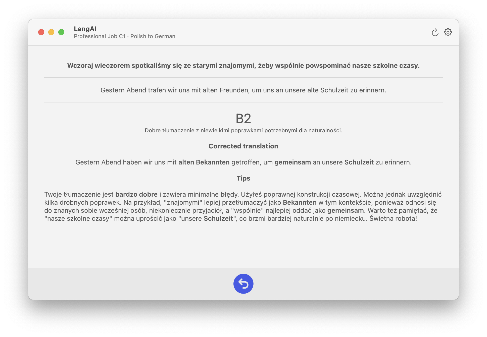

# LangsAI - Language Learning Assistant

LangsAI is a macOS application designed to help users improve their language translation skills. The app generates sentences using LLM in a source language and evaluates the user's translations, providing feedback.

## Features

- **Sentence Generation**: Generates sentences in your chosen source language based on CEFR level and context.
- **Translation Practice**: Allows you to practice translating sentences to your target language

To use LangsAI, you'll need to configure a few things, like LLM connection, source and target language, CEFR level and language context.

These settings can be accessed through the Preferences menu (⌘+P).

## How to Use

1. Launch the app
2. Configure your preferences
3. The app will generate a sentence in your source language
4. Type your translation in the text field
5. Submit your translation using the arrow button
6. Review the AI feedback and rating
7. Click the refresh button to get a new sentence

## Requirements

- iOS 17.0+ / macOS 14.0+
- Xcode 15.0+
- Swift 5.9+
- Valid LLM API credentials

## Privacy

LangsAI sends your translations to the configured LLM service for evaluation. No user data is stored or collected by the app itself.

## License

LangsAI is licensed under Apache License, Version 2.0
